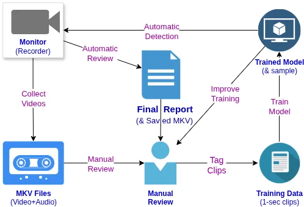

About DTrack
============

**Disturbance Track (DTrack)** offers 24/7 monitoring that uses Machine
Learning (AI) to identify disturbing noises, such as dog barking or car alarms.

Rather than using expensive "cloud" infrastructure for advanced categorization,
DTrack creates a model that is trained to detect only the exact noise that it
was trained on. This helps eliminate false positives and decreases the effort
required to perform matching.

How It Works
------------

1. Set up the Monitoring Device
2. Collect some initial recordings
3. Train a model from collected recordings
4. Use trained model for automatic detection

Why It Exists
-------------

In some jurisdictions, understaffing leads to complete dismissal of any call
that is not life threatening. In these cases, even a detailed report of ongoing
noise disturbances may be entirely dismissed without a full 48 hours of detailed
(to-the-minute) logging of every single occurrence, alongside submitted video.

Painstakingly listening to this audio in order to accurately log each and every
disturbance, unsurprisingly, adds to overall frustration, but it also yields a
report that is guaranteed to be taken seriously by a District Attorney.

DTrack exists to provide an initial report that can be easily reviewed in much
less time.

How Is This Possible?
---------------------

Most scoffs at this endevour have come from an understanding that large datasets
are huge and take a tremendous amount of power to work with, making it impossible
to keep detection entirely within lightweight hardware. This comes from a
fundamental misunderstanding of what detection is actually needed.

Consider which of the following questions is easier for a computer to answer:

1. Is a banana present in this image?
2. Is a <u>whole, pristine, ripe, yellow</u> banana present in this image?

The former can include **any** type of banana. It could still be green, or
perhaps yellow but cut in half, or brown and smashed. At what point of decay is
it no longer a banana? Large data models take all of these questions into
consideration and then try to apply tags that answer yes or no to each question.

Disturbance Tracker only cares about the tag that it was trained to detect, which
eliminates extra overhead and makes detection a very lightweight operation.
