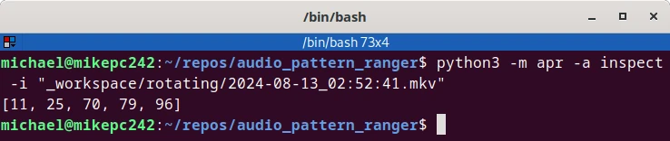

Manual Inspection
=================

After `model.{pth,wav}` are generated, the `inspect` action can be used to
manually review individual video (`.mkv`) files.

```sh
       python3 -m train.check -M $model_name -i $path_to_mkv
```

This returns a list of frames where the trained noise was detected.



These frames can then be reviewed/tagged using [the review utility](review.md)
and then used [train](train.md) an improved model.
