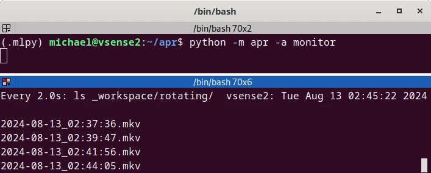
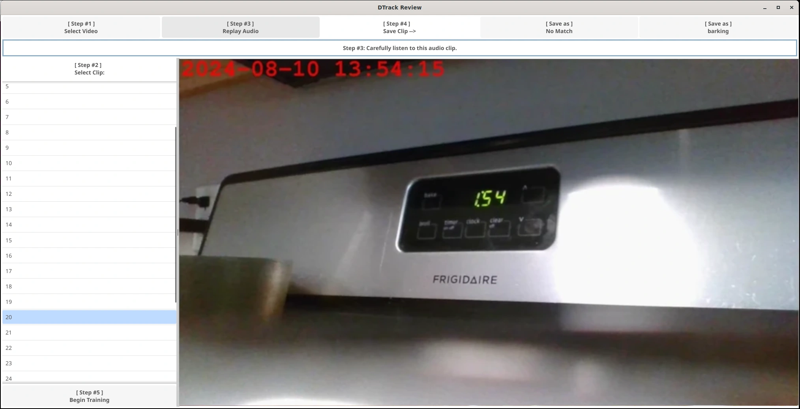
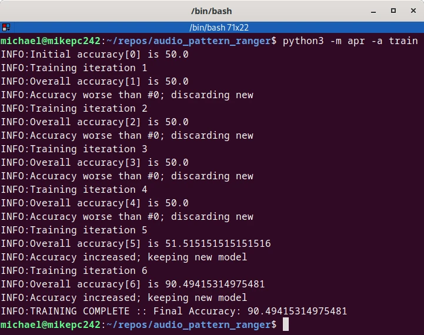
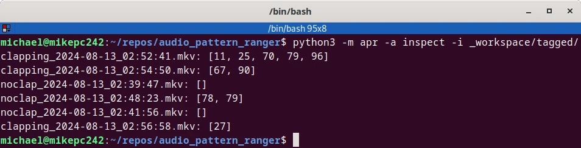

Using DTrack
============

DTrack is essentially broken into ...

1\. [Data Collection](collect.md) (monitor without model)

> 

2\. [Data Analysis](review.md) (review)

> 

3\. [Model Training](train.md) (train)

> 

4\. [Manual Inspection](inspect.md) (interact with model)

> 

5\. [Automatic Reporting](report.md) (monitor with model)

> To Do ...<!--(../_images/report.webp)-->
